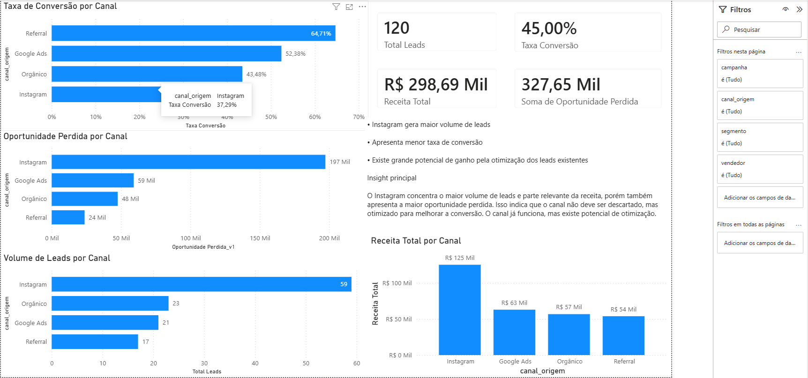

# Análise Comercial de Leads: Oportunidades Perdidas e Gargalos de Conversão

## Visão Geral

Este projeto analisa uma base comercial de leads para identificar gargalos de conversão, oportunidades perdidas de faturamento e padrões de desempenho por canal de origem.

A análise segue um fluxo completo de projeto de dados: entendimento do problema, diagnóstico da base, limpeza, aplicação de regras de negócio, criação de métricas, análise exploratória, levantamento de hipóteses, geração de insights e conclusão executiva.

## Problema de Negócio

Apesar da geração constante de leads, a empresa não possuía visibilidade clara sobre onde ocorriam perdas de oportunidades ao longo do processo comercial.

Sem uma análise estruturada, tornava-se difícil identificar quais canais, campanhas ou segmentos apresentavam baixa eficiência na conversão, impactando diretamente o potencial de faturamento do negócio.

## Objetivo

Identificar gargalos no funil comercial, oportunidades perdidas de faturamento e padrões de comportamento dos leads por meio da análise dos dados comerciais.

O projeto busca apoiar decisões relacionadas à qualificação de leads, eficiência dos canais de aquisição, priorização comercial e melhoria da conversão.

## Estrutura da Análise

O notebook foi organizado seguindo uma narrativa profissional de análise de dados:

1. Contexto
2. Problema
3. Objetivo
4. Diagnóstico
5. Limpeza
6. Regras de negócio
7. EDA
8. Hipóteses
9. Insights
10. Conclusão

## Dataset

Foi utilizada uma base simulada de um processo comercial baseado em leads, contendo informações relacionadas à origem do lead, campanha, segmento, vendedor, proposta e venda.

Arquivos principais:

- `dataset/base_bruta_leads_vendas.csv`: base original, contendo inconsistências propositalmente inseridas.
- `dataset/base_tratada.csv`: base final após limpeza, padronização e criação de métricas.
- `notebook_analise.ipynb`: notebook principal com toda a análise documentada.

Principais campos utilizados:

- `id_lead`
- `data_cadastro`
- `canal_origem`
- `campanha`
- `segmento`
- `cidade`
- `vendedor`
- `status_lead`
- `valor_proposta`
- `venda_fechada`
- `valor_venda`

## Tratamentos Realizados

A base foi construída com inconsistências para simular problemas comuns em projetos reais de dados. Durante a análise foram realizados:

- diagnóstico da estrutura da base;
- verificação de duplicidade em `id_lead`;
- padronização de colunas de data;
- normalização de categorias em canal de origem, cidade e vendedor;
- análise de valores nulos;
- conversão de campos financeiros para formato numérico;
- validações de regras comerciais;
- criação da métrica de oportunidade perdida;
- exportação da base tratada.

## Regra de Negócio Principal

A principal métrica criada foi `oportunidade_perdida`.

Essa métrica representa o valor potencial de faturamento associado a leads que receberam proposta, mas não foram convertidos em venda.

Regra aplicada:

```text
Se venda_fechada = "não" e valor_proposta não é nulo:
    oportunidade_perdida = valor_proposta
Caso contrário:
    oportunidade_perdida = 0
```

## Principais Análises

Foram avaliados os seguintes indicadores por canal de origem:

- quantidade de leads;
- quantidade de vendas fechadas;
- receita total;
- oportunidade perdida;
- taxa de conversão.

Essas análises permitiram comparar volume, conversão e potencial financeiro não realizado entre os canais.

## Hipótese Avaliada

A hipótese principal levantada foi:

> O Instagram gera grande volume de leads, porém com menor eficiência de conversão.

A análise indica que o canal possui relevância em volume e receita, mas também apresenta baixa eficiência relativa de conversão e concentração relevante de oportunidades perdidas.

## Principais Insights

- O negócio apresenta boa capacidade de geração de leads.
- O principal desafio identificado não está apenas na aquisição, mas na eficiência da conversão comercial.
- O Instagram aparece como um canal relevante em volume, mas com atenção necessária sobre qualificação e conversão.
- Existe potencial de crescimento ao otimizar leads já captados, reduzindo a dependência imediata de aumento de investimento em aquisição.
- A criação de critérios de qualificação pode ajudar o time comercial a priorizar oportunidades com maior probabilidade de fechamento.

## Dashboard

O dashboard foi desenvolvido no Power BI para fornecer uma visão executiva do funil comercial e responder:

> Onde o negócio está perdendo oportunidades de faturamento?

Principais indicadores:

- Total Leads
- Taxa de Conversão
- Receita Total
- Oportunidade Perdida



## Recomendações

- Criar métricas de qualificação de leads.
- Priorizar oportunidades com maior probabilidade de conversão.
- Revisar campanhas e mensagens dos canais com maior concentração de oportunidade perdida.
- Evoluir a análise para um modelo de lead score.
- Incluir variáveis como custo por canal, tempo de atendimento e histórico de interações comerciais.

## Tecnologias Utilizadas

- Python
- Pandas
- NumPy
- Jupyter Notebook

## Como Executar o Projeto

1. Clone este repositório.
2. Abra o arquivo `notebook_analise.ipynb`.
3. Execute as células em ordem.
4. A base tratada será gerada em `dataset/base_tratada.csv`.

Bibliotecas utilizadas no notebook:

```text
pandas
numpy
matplotlib
seaborn
```

## Limitações

Esta análise utiliza uma base simulada e não considera variáveis como custo por canal, perfil detalhado dos leads, SLA de atendimento, histórico de interações ou origem detalhada por campanha.

Essas informações poderiam aprofundar a análise de rentabilidade, eficiência comercial e priorização de oportunidades.

## Próximos Passos

- Desenvolver critérios de lead score.
- Criar visualizações em dashboard.
- Adicionar análise por campanha e segmento.
- Avaliar tempo entre cadastro, primeiro contato, proposta e venda.
- Comparar receita realizada com oportunidade perdida por canal.

## Conclusão

A análise identificou que o negócio possui volume relevante de oportunidades geradas, mas parte desse potencial não está sendo convertido em receita.

O principal caminho recomendado é melhorar a qualificação dos leads e priorizar oportunidades com maior chance de fechamento, aumentando a eficiência comercial sem depender exclusivamente de maior volume de aquisição.

Durante o desenvolvimento do dashboard foi identificada uma inconsistência relacionada à interpretação dos valores monetários no Power BI, causada pelo padrão de separador decimal.

Foi necessário corrigir a transformação dos dados para garantir a consistência das métricas financeiras.

## Evoluções Futuras

Como continuidade do projeto, algumas análises adicionais podem ser exploradas:

- Performance por vendedor
- Lead Score
- Conversão por segmento
- Tempo médio até conversão
- Modelo preditivo de conversão